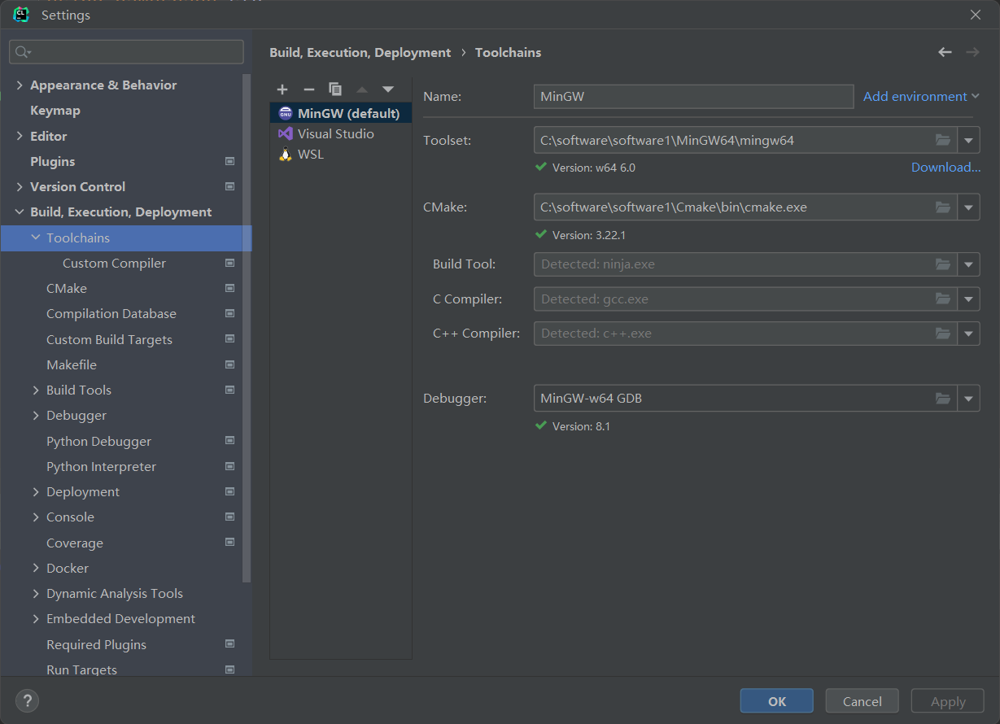
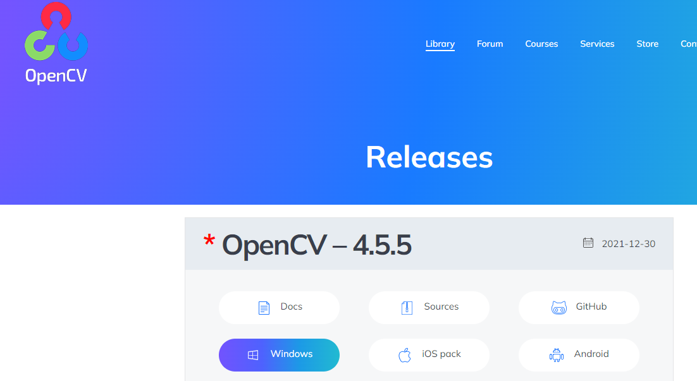
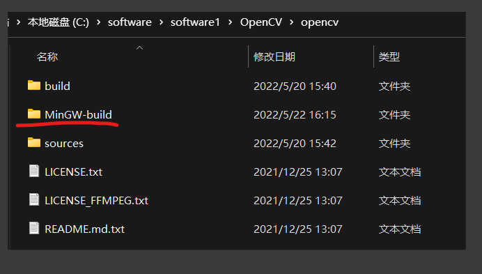
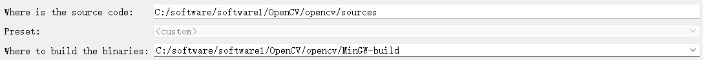
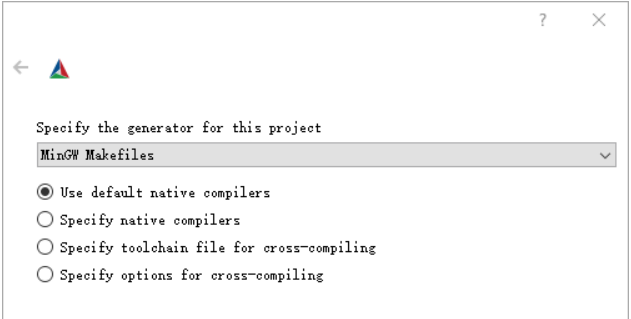
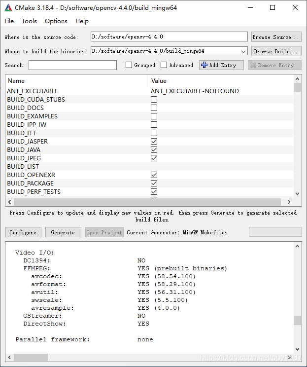
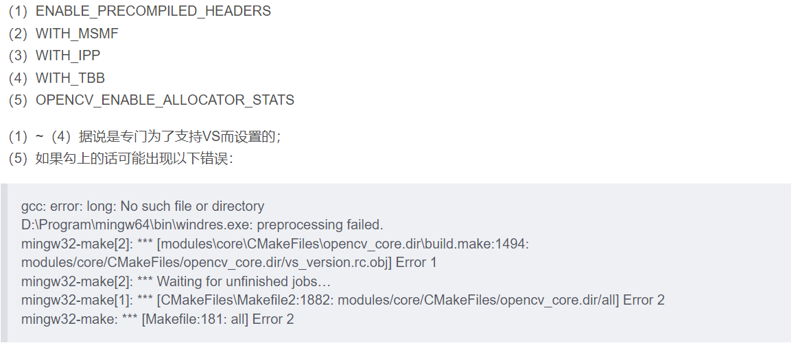
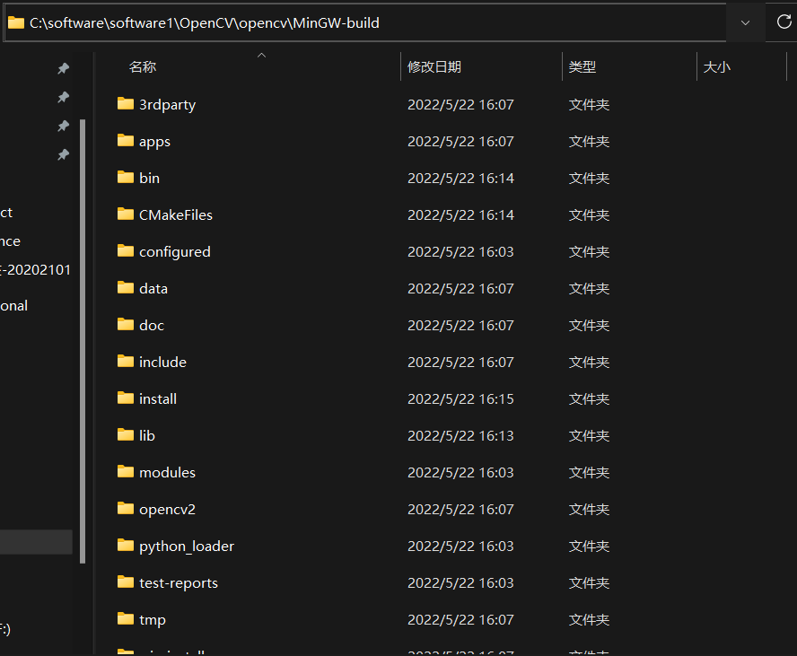
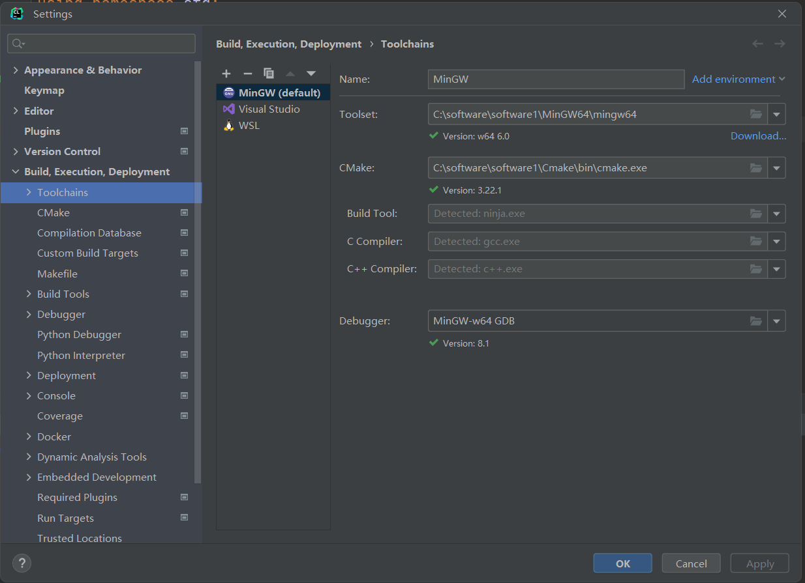

+ [(29条消息) CLion + OpenCV + cmake，源码编译及使用_拜阳的博客-CSDN博客](https://blog.csdn.net/bby1987/article/details/108985356)

# OpenCV Windows下使用Clion开发的教程

## MinGW64

+ 下载 MinGW64，https://sourceforge.net/projects/mingw-w64/files/Toolchains%20targetting%20Win64/Personal%20Builds/mingw-builds/8.1.0/threads-posix/seh/x86_64-8.1.0-release-posix-seh-rt_v6-rev0.7z/download
+ 解压到指定目录后，将`.\mingw64\bin`添加到系统变量
  + 

## 安装Cmake

+ Clion 有一个支持的最新的Cmake版本，基于Clion可以支持的版本安装Cmake
  + 
+ [Index of /files (cmake.org)](https://cmake.org/files/)这里有所有的历史Cmake版本，windows 64位安装，下载msi文件
  + 

+ 将Cmake添加到系统变量，安装过程会自动提示添加到系统变量。如果没有需要手动添加。
  + 


## 下载OpenCV

+ 在OpenCV官网，Library/Release/下，下载Windows版本的OpenCV
+ 
+ 下载后的文件如图所示
  + 
+ 点击安装，可以选择安装路径。


## 使用Cmake构建OpenCV工程

+ 在OpenCV安装目录下新建 MinGW-build文件夹
  + 
+ 打开Cmake软件
  + 将上图中的sources文件目录放到“Where is the source code”
  + 将上图中的MinGW-build文件目录放到“Where to build the binaries”
  + 
  + 点击Configure, 选择如图配置
    + 
+ 之后再次点击Configure即可进行编译工作。编译较慢，可以多编译几次，直到中间没有出现红色。
  + 
+ 确保如下选项没有打勾
  + 
+ 点击Generate生成工程。


## MinGW64编译OpenCV工程

+ windows终端进入此目录
  + 
  + 执行`mingw32-make`或者使用`mingw32-make -j8`指定编译线程数，这里表示8个线程
  + 中途出现warning不用管，如果出现error就会导致失败而退出编译。如果error需要使用`mingw32-make clean`清除之前错误编译然后再重新编译
  + 如果成功编译,执行`mingw32-make install`
+ 将MinGW-build\install\x64\mingw\bin这个路径添加到系统变量
  + 


## 配置Clion 工程

+ File\Settings\Build, Execution, Deployment

  + 

+ CmakeLists.txt

  + ```sh
    # 指定 Cmake 版本
    cmake_minimum_required(VERSION 3.22)
    
    project(test)
    set(CMAKE_CXX_STANDARD 14)
    add_executable(test main.cpp)
    
    # 设置 OpenCV
    set(OpenCV_DIR C:/software/software1/OpenCV/opencv/MinGW-build/install)
    find_package(OpenCV REQUIRED)
    target_link_libraries(test ${OpenCV_LIBS})
    ```

+ 测试代码

  + ```cpp
    #include <iostream>
    #include <string>
    #include <opencv2/opencv.hpp>
    using namespace std;
    using namespace cv;
    
    int main() {
    
        string path = "C:\\Users\\yangbo\\Desktop\\test\\camera_1.jpg";
    
        Mat image = imread(path);
        imshow("Test", image);
        waitKey(0);
    
        return 0;
    }
    ```